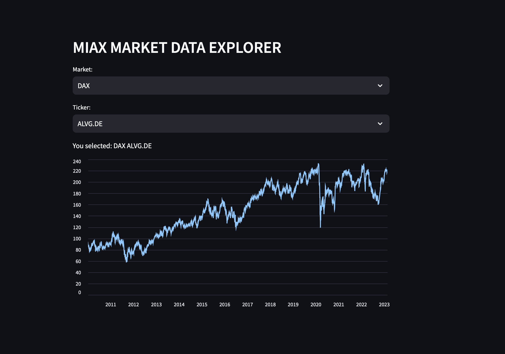

# Aplicación Streamlit Final

---

- Vamos a realizar una aplicación que nos muestre los datos del API que anteriormente se usaba en la práctica de algoritmos.

---
# 1. Interacción con el API

La api tiene dos métodos:

- El primero nos da los tickers de un indice:
https://web-api-miax-jog4ew3z3q-ew.a.run.app/data/ticker_master?competi=mia_12&market=IBEX
El parametro market puede ser: IBEX, DAX o EUROSTOXX

- El segundo nos da los datos de cierre para un ticker de un mercado:
https://web-api-miax-jog4ew3z3q-ew.a.run.app/data/time_series?market=IBEX&ticker=SAN&close=true

Codifica una clase que tenga dos métodos, uno que retorne los ticker de un mercado y otro los datos de el cierrre par un ticker dado.

---
# 2. Frontal
Desarrolla un frontal que:
- Tenga dos dropdown menús para el índice y para los tickers.
- Al cambiar el índice se tiene tiene que actualizar el gráfico.
- Mostramos los datos de cierre en una gráfica de línea para el activo y el mercado.

Puedes hacerlo con dash o con streamlit.
