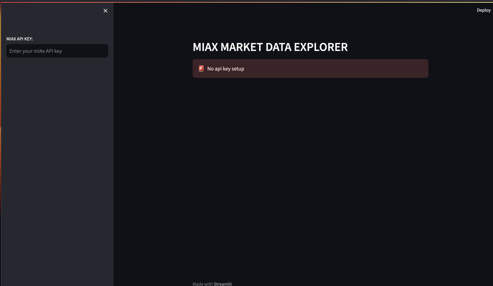
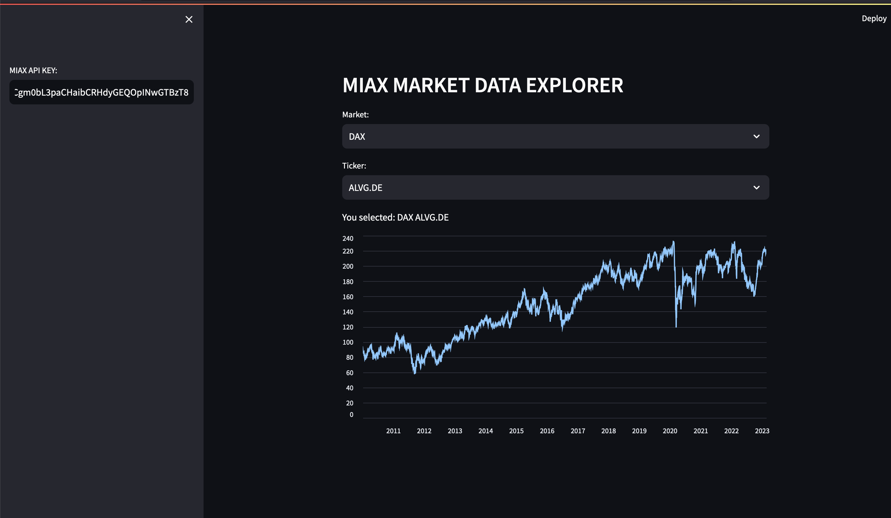

# Aplicación Streamlit Final

---

- Vamos a realizar una aplicación que nos muestre los datos del API de la práctica de algoritmos.
- De forma iterativa mejoraremos la aplicación.

---
# Paso 1
- Generamos dos dropdown menús para el índice y para los tickers.
- Al cambiar el índice se tiene tiene que actualizar el gráfico.
- Mostramos los datos de cierre en una gráfica de línea para el activo y el mercado.

---
# Paso 2
- Añadimos la opcion de configurar el API key en el sidebar

---

